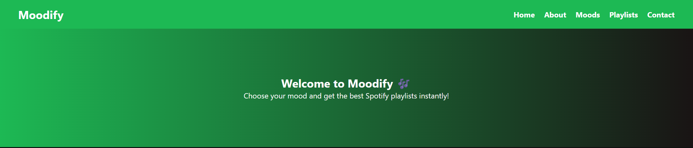

# 🎶 Moodify - Music Recommendation App

Moodify is a web application that recommends and plays music based on your current mood (Happy, Sad, Relax, Energetic, etc.).  
It’s a fun project where music changes according to how you feel. 💙

---

## 🚀 Features
- Choose your mood and get a playlist instantly.
- Embedded music player (via iframe).
- Simple, clean UI.
- Easy navigation between moods and playlists.

---

## 🛠️ Tech Stack
- **Frontend**: HTML, CSS, JavaScript  
- **Backend**: Node.js (Express)  
- **Version Control**: Git & GitHub  

---

## 📸 Screenshots  

### 🏠 Home Page  
  

### 🎵 Playlist Page  
  

### ℹ️ About Page  
  


---

## ⚡ Getting Started
1. Clone this repo:
   ```bash
   git clone https://github.com/Tanvi618/Moodify-App.git
